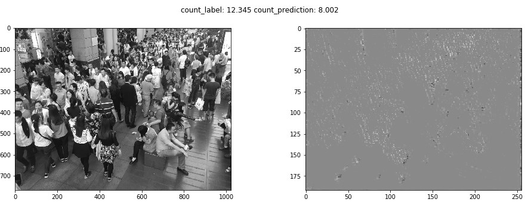

# Multi_column_CNN_in_Keras_for_crowd_counting
A simple and unofficial Keras version implementation of Multi-column CNN for crowd counting.

Multi-column CNN is the crowd counting algorithm proposed in a CVPR 2016 paper ["Single Image Crowd Counting via Multi Column Convolutional Neural Network"](https://www.cv-foundation.org/openaccess/content_cvpr_2016/papers/Zhang_Single-Image_Crowd_Counting_CVPR_2016_paper.pdf).

## Data preprocessing:

The data can be downloaded on [dropbox](<https://www.dropbox.com/s/fipgjqxl7uj8hd5/ShanghaiTech.zip?dl=0>) or [Baidu Disk](<http://pan.baidu.com/s/1nuAYslz>) can't be used directly without some preprocessing.

Please refer to the preprocessing implemented in [this mcnn repository]((https://github.com/svishwa/crowdcount-mcnn#data-setup)) in pytorch.

## Result:

